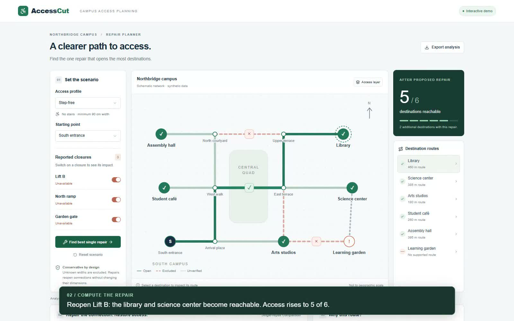

# AccessCut

## For judges

**[Open the live prototype](https://accesscut.vercel.app)** · **[Watch the short demo](https://accesscut.vercel.app/demo)** · **[Download the MP4](https://accesscut.vercel.app/accesscut-demo.mp4)**

The live app and video are public and require no account. The video is an approximately 72-second, captioned screen recording of the working production build (no narration).

**Try the hero moment:** keep the default Step-free profile and click **Find best single repair**. Preview Lift B to see reachable destinations increase from **3/6 to 5/6**. Apply it, reset, then select Wide wheelchair to see width constraints change the ranking.



An interactive campus accessibility repair planner. Select an access profile and origin, mark connections unavailable, and compare every single reopening by the number of newly reachable destinations. Inspect the shortest supported route and export the current analysis as JSON.

## Run

Requires Node.js 22.13+ (Node 24 recommended).

```sh
npm ci
npm run dev
```

Open the local URL printed by the server. For the Vercel/Next.js runtime use `npm run dev:vercel`, or `npm run build:vercel` followed by `npm run start:vercel`. The original Worker runtime remains available through `npm run build` and `npm start`. No paid map API, ML service, API key, GPU, or database is needed.

## Hosting

Production is hosted on Vercel at **https://accesscut.vercel.app**. `vercel.json` selects the standard Next.js build and this repository is connected to the Vercel project for Git deployments. `/api/analyze` runs server-side. The demo is hosted at `/demo` and its MP4 is served directly from `public/`.

## Architecture

React + TypeScript interface → POST `/api/analyze` → scenario validation → graph filtering → Dijkstra shortest paths → exhaustive single-repair comparison → SVG map and ranked explanations.

The deployment uses a TypeScript server route, rather than FastAPI, so the complete app runs within the Next.js deployment. The same source also supports the original Cloudflare Worker build. `lib/accesscut.ts` contains the synthetic fixture and deterministic engine. `app/api/analyze/route.ts` is the server boundary. There are no model confidence scores or learned inferences.

The undirected fixture has 12 nodes, 14 connections, six destinations, three repairable closures, and three access profiles. Dimensions and distances are invented, not surveyed. The map is schematic. This is a planning demonstration, not real navigation guidance or accessibility certification.

## Decision rules

- Remove reported closures, incompatible stairs, widths below the profile threshold, and all unverified widths.
- Minimize route distance on the remaining nonnegative graph.
- Evaluate each currently closed, repairable connection independently. A repair only reopens it; width and stair attributes stay unchanged.
- Rank by additional reachable destinations **from the selected origin**, with equal weights. Break equal-gain ties alphabetically. This is not a campus-wide all-pairs objective, a repair-cost optimizer, or a multi-repair optimizer.
- If the origin is a destination, count it as reachable at zero distance.
- A preview is a separate computed scenario; applying it explicitly changes the closure list.
- Excluded connections list all graph exclusions; it does not claim every listed edge caused a particular route failure.

Complexity with this straightforward Dijkstra implementation is O(V² + VE) per solve, repeated once per candidate plus the baseline. This tiny graph needs neither a solver service nor ML.

## Verification

```sh
node --test tests/graph.test.mjs
npx tsc --noEmit
npm run build
```

The graph suite checks all 288 combinations of 3 profiles × 8 closure sets × 12 origins against an independently implemented Floyd-Warshall shortest-path oracle. It also checks path continuity, distances, repair gains, invalid requests, and unknown-width handling. Test counts are not evidence of real-world data quality.

## API

```json
{"profile":"step-free","origin":"gate","closed":["lift-b","north-ramp","garden-gate"]}
```

POST this JSON to `/api/analyze`. Returns scenario, fixture version, reachable count, destination paths, exclusion reasons, repair ranking, and measured server computation time. Invalid inputs return 400. Request text over 10,000 characters returns 413.

## Submission

Use the live prototype and demo links at the top of this README. This repository is public. `public/accesscut-demo.mp4` contains the recorded short walkthrough; `DEMO.md` also retains an optional longer presentation outline. The recorded walkthrough uses real browser interactions and computed API responses; its captions are recording annotations, not app features.

## Known scope limits

No real campus import, elevation/slope analysis, live lift feed, audited measurements, user accounts, or durable scenario storage. Refresh resets the demonstration. No claim that reopening an asset is physically feasible or sufficient without a real inspection. Costs, priority weights, and coordinated multi-repair effects are outside this MVP.
